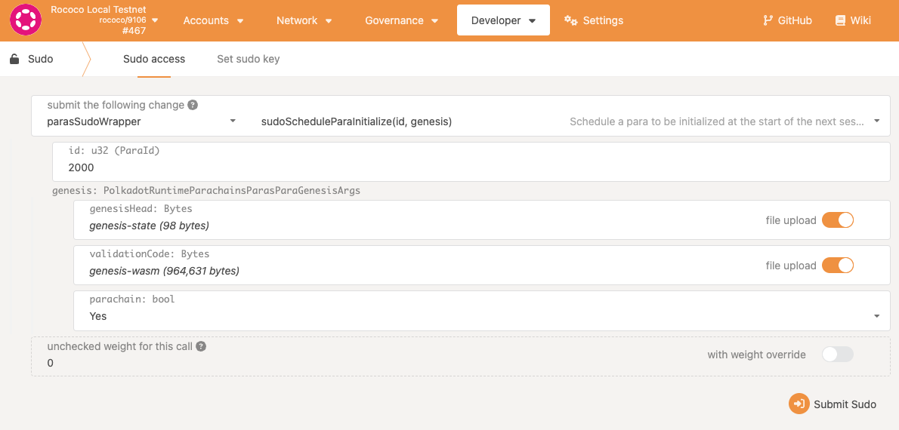
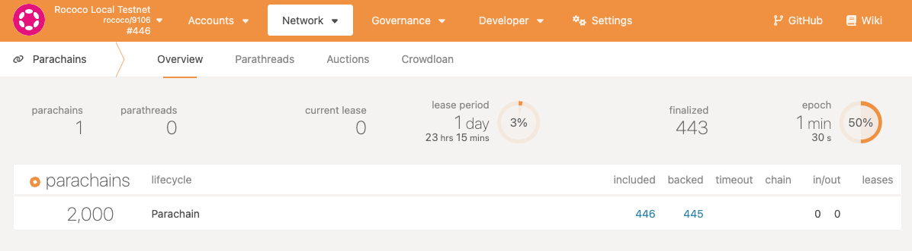

<div><a href="https://github.com/w3f/Open-Grants-Program/pull/268"></a></div>
OAK(Onchain Autonomous Framework) is a unique blockchain built on Substrate framework with an event-driven execution model, autonomous transactions, and on-chain scheduling.

# Introduction

**OAK, or Onchain Automation Framework, is equipped with a novel smart contract virtual machine that supports an event-driven execution model, enabling developers to build fully autonomous decentralized application.** By extending the current set of atomic operations, namely, opcodes of EVM, OAK introduces an innovative way for contracts to interact with each other. Contracts can emit signal events, on which other contracts can listen. Once an event is triggered, corresponding handler functions are automatically executed as a new type of transaction, signal transaction. Applications implemented with this new approach will eliminate dependency of unreliable components such as off-chain relay servers, and in return, significantly simplify execution flow and avoid security risks such as man-in-the-middle attacks.

Benefits of OAK technology,
- **Secure automation**
- **Easy integration**
- **Built-in private oracle**
## Live Networks
- `Turing Staging`: Rococo parachain (Jan 2022)
- `Turing Network`: Kusama parachain (April 2022)
- `OAK Network`: Polkadot parachain (target launch Q1 2023)
## Documentation
* [Website](https://oak.tech/)
* [Documentation](https://docs.oak.tech/)
## Community
* General discussion: [Telegram](https://t.me/OAK_Announcements)
* Technical discussion: [Discord](https://discord.gg/7W9UDvsbwh)
* Follow us on [Twitter](https://twitter.com/oak_network)
* Subscribe to [Medium Newsletter](https://medium.com/oak-blockchain)

# Run the blockchain
Binaries of Turing Network can be found on [Releases](https://github.com/OAK-Foundation/OAK-blockchain/releases) page of this repo.

For instructions of setting up a Turing Network collator, please refer to our documentation on [docs.oak.tech](https://docs.oak.tech/docs/setup-collator-node/).
# Develop
The best way to run our blockchain and debug its code is via building from source. In this chapter we will explain the method to set up a local Rococo network with Turing and other parachains.
## Build from source

Ensure you have Rust and the support software (see shell.nix for the latest functional toolchain):

    curl https://sh.rustup.rs -sSf | sh
    # on Windows download and run rustup-init.exe
    # from https://rustup.rs instead

    rustup update nightly
    rustup target add wasm32-unknown-unknown --toolchain nightly

    # [!Important] Make sure the rustup default is compatible with your machine, for example, if you are building using Apple M1 ARM you need to run
    rustup install stable-aarch64-apple-darwin
    rustup default stable-aarch64-apple-darwin

You will also need to install the following dependencies:

* Linux: `sudo apt install cmake git clang libclang-dev build-essential`
* Mac: `brew install cmake git llvm`
* Windows: Download and install the Pre Build Windows binaries of LLVM from http://releases.llvm.org/download.html

Install additional build tools:

    cargo +nightly install --git https://github.com/alexcrichton/wasm-gc

Clone OAK-blockchain code from Github:

    git clone git@github.com:OAK-Foundation/OAK-blockchain.git    

Then, build the code into binary:
```bash
cargo build --release --features turing-node --features dev-queue
```
> In order to make local testing easy, use a `dev-queue` flag which will allow for putting a task directly on the task queue as opposed to waiting until the next hour to schedule a task.  This works when the `execution_times` passed to schedule a task equals `[0]`.

At this point, the binary of Turing Dev is built and located at `./target/release/oak-collator`. 

### Build the relay chain
Turing Dev is a parachain and doesn’t produce block without a relay chain, so next we will need to clone Polkadot’s code and build a local Rococo(relay chain).

First, find out a compatible version of the relay chain’s code from this repo’s `polkadot-parachain-primitives` reference in [./runtime/turing/Cargo.toml](https://github.com/OAK-Foundation/OAK-blockchain/blob/master/runtime/turing/Cargo.toml), for example,
```
polkadot-parachain-primitives = { git = "https://github.com/paritytech/polkadot-sdk", default-features = false, branch = "release-v0.9.29" }
```

release-v0.9.29 is the version of relay chain to run, so let’s build its source with the below commands.

```bash
git clone --branch release-v0.9.29 https://github.com/paritytech/polkadot-sdk
cd polkadot
cargo build --release
```

### Build another parachain
Here we are using [a copy of Mangata’s code](https://github.com/OAK-Foundation/mangata-node/tree/automation-demo) as an example of another parachain.

First, clone and compile the code with `mangata-rococo` feature for a parachain.

```
git clone --branch automation-demo https://github.com/OAK-Foundation/mangata-node

cd mangata-node

cargo build --release --features mangata-rococo
```
The binary file is located at ./target/release/mangata-node.

## Quickstart - run local networks with Zombienet
We have configured a network of 2 relay chain nodes, 1 Turing node and 1 Mangata node in [zombienets/turing/mangata.toml](https://github.com/OAK-Foundation/OAK-blockchain/blob/master/zombienets/turing/mangata.toml), so the easiest way to spin up a local network is through below steps.

1. Clone and build source of [Zombienet]
   1. `git clone https://github.com/paritytech/zombienet.git`. It’s recommended to check out a stable release version instead of using the code on master branch. For example, the latest stable version tested is [v1.3.63](https://github.com/paritytech/zombienet/releases/tag/v1.3.63), and you sync to the tip of by calling `git fetch --tags && git checkout v1.3.63`.
   1. `cd zombienet/javascript`
   1. Make sure your node version is compatible with that in [javascript/package.json](https://github.com/paritytech/zombienet/blob/main/javascript/package.json), for example `"node": ">=16"`.
   1. `npm install`
   1. `npm run build`
2. After a successful build, you should be able to test run `npm run zombie`.
3. Create an alias to the zombie program(on MacOS). Since the actual command of `npm run zombie` is `node ./packages/cli/dist/cli.js`, we can add an alias to it by editing the `~/.bash_profile` file. Simply, run `vim ~/.bash_profile` add one line `alias zombienet="node <your_absolute_path>/zombienet/javascript/packages/cli/dist/cli.js"` to it.
4. Run `source ~/.bash_profile`. This will load the new ~/.bash_profile.
5. Cd into OAK-blockchain folder, `cd ../../OAK-blockchain`.
6. Spawn zombienet with our config file, `zombienet spawn zombienets/turing/mangata.toml`.

> Note that if you encounter issue with the above source code build approach and running it on MacOS, try to download the `zombienet-macos` binary from its Release page and run `./zombienet-macos spawn zombienets/turing/mangata.toml`.

The zombie spawn will run 2 relay chain nodes, 1 Turing node and 1 Mangata node, and set up an HRMP channel between the parachains.

## Slo-mo - manually run local networks
In this section we will walk through the steps of manually running a local network with a Rococo relay chain, a Turing parachain and a Mangata parachain.

### 1. Launch a Rococo relay chain
First, navigate to under polkadot repo’s local folder.

With the binary built in `./target/release/polkadot`, open up two terminal windows to run two nodes separately.

1. Run node Alice in the first terminal window
    ```bash
    ./target/release/polkadot \
    --alice \
    --validator \
    --tmp \
    --chain ../OAK-blockchain/resources/rococo-local.json \
    --port 30333 \
    --ws-port 9944
    ```
1. Run node Bob in the second terminal window
    ```bash
    # Bob (In a separate terminal)
    ./target/release/polkadot \
    --bob \
    --validator \
    --tmp \
    --chain ../OAK-blockchain/resources/rococo-local.json \
    --port 30334 \
    --ws-port 9945
    ```
At this point, your local relay chain network should be running. Next, we will launch a Turing Network node and connect it to the relay chain as a parachain.

### 2. Launch Turing Network as a parachain
Navigate to under OAK-blockchain repo’s local folder. The binary built is located at `./target/release/oak-collator`.

Then, prepare two files, genesis-state and genesis-wasm, for parachain registration.
```bash
# Generate a genesis state file
./target/release/oak-collator export-genesis-state --chain=turing-dev > genesis-state

# Generate a genesis wasm file
./target/release/oak-collator export-genesis-wasm --chain=turing-dev > genesis-wasm
```

Third, run the oak-collator binary.
```bash
./target/release/oak-collator \
--alice \
--collator \
--force-authoring \
--tmp \
--chain=turing-dev \
--port 40333 \
--ws-port 9946 \
-- \
--execution wasm \
--chain ./resources/rococo-local.json \
--port 30335 \
--ws-port 9977 
```
After this command you should be able to see the stream output of the node.
#### Register Turing parachain on Rococo
1. Navigate to [Local relay sudo extrinsic](https://polkadot.js.org/apps/?rpc=ws%3A%2F%2F127.0.0.1%3A9944#/sudo)
2. Register your local parachain on the local relay chain by calling `parasSudoWrapper.sudoScheduleParaInitialize` (see the screenshot below). 
3. Parameters:
    1. id: **2114**
    2. genesisHead: switch on "File upload" and drag in the above generated `genesis-state` file.
    3. validationCode: switch on "File upload" and drag in the `genesis-wasm` file.
    4. parachain: Yes.

1. Once submitted, you should be able to see the id:2114 from the [Parathread](https://polkadot.js.org/apps/?rpc=ws%3A%2F%2F127.0.0.1%3A9944#/parachains/parathreads) tab, and after a short period on the [Parachains](https://polkadot.js.org/apps/?rpc=ws%3A%2F%2F127.0.0.1%3A9944#/parachains) tab.
2. Once Turing is onboarded as a parachain, you should see block number start to increase on [Turing explorer](https://polkadot.js.org/apps/?rpc=ws%3A%2F%2F127.0.0.1%3A9946#/explorer).

### 3. Launch Mangata as a parachain
This step is optional as you can spin up another project or Turing Network as the second parachain, but for testing XCM functionality we use another parachain, Mangata, as an example here.

Navigate to under mangata-node repo’s local folder. The binary built is located at `./target/release/mangata-node`.

Second, prepare two files, genesis-state and genesis-wasm, for parachain registration.
```bash
# Generate a genesis state file
./target/release/mangata-node export-genesis-state  --chain=mangata-rococo-local-testnet > genesis-state

# Generate a genesis wasm file
./target/release/mangata-node export-genesis-wasm  --chain=mangata-rococo-local-testnet > genesis-wasm
```

Lastly, start up the build.
```
./target/release/mangata-node --alice --collator --force-authoring --tmp --chain=mangata-rococo-local-testnet --port 50333 --ws-port 9947 -- --execution wasm  --chain ../OAK-blockchain/resources/rococo-local.json --port 30336 --ws-port 9978
```

> Note that,
> - `–chain=mangata-rococo-local-testnet` is necessary for the chain config.
> - The relay chain config is the same as that of Turing, as in from the file `../OAK-blockchain/resources/rococo-local.json`
> - Port numbers need to be different from those of Turing, otherwise there will be port collisions

Up to this point the Mangata node is up and running, but not producing blocks yet. We will repeat the parachain onboarding process below to connect it to Rococo.
#### Register Mangata on Rococo
1. Navigate to [Local relay sudo extrinsic](https://polkadot.js.org/apps/?rpc=ws%3A%2F%2F127.0.0.1%3A9944#/sudo)
2. Register Mangata on the local Rococo by calling `parasSudoWrapper.sudoScheduleParaInitialize`. 
3. Parameters:
    1. id: **2110**
    2. genesisHead: switch on "File upload" and drag in the above generated `genesis-state` file.
    3. validationCode: switch on "File upload" and drag in the `genesis-wasm` file.
    4. parachain: Yes.

Great, at this point you have completed all steps of setting up local networks of Rococo, Turing and Mangata! In order to test XCM functionality, next refer to our guid on [docs.oak.tech](https://docs.oak.tech/docs/developer-guide-overview/).

Contacts
--------
Maintainers: [OAK Development Team](https://github.com/orgs/OAK-Foundation/people)

If you have any questions, please ask our devs on [Discord](https://discord.gg/7W9UDvsbwh)

* * *

OAK blockchain is licensed under the GPLv3.0 by the OAK Network team.
