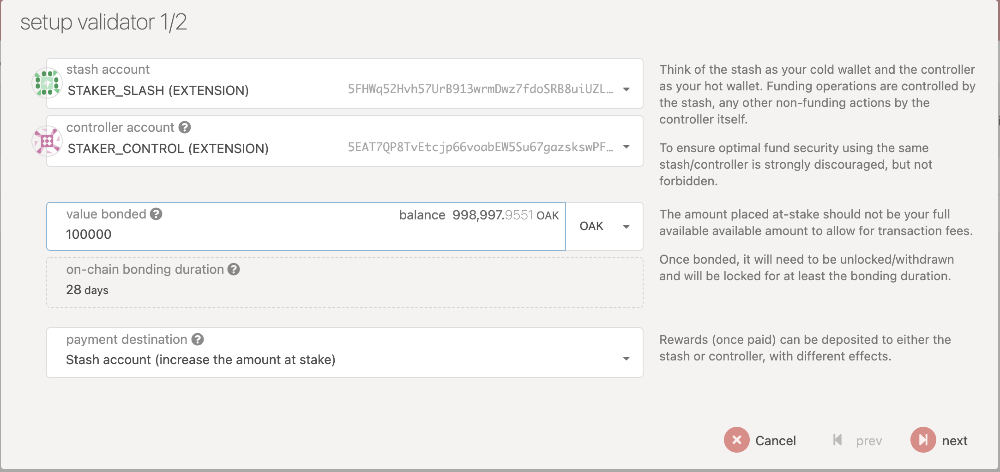
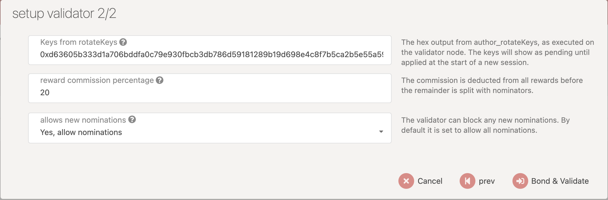
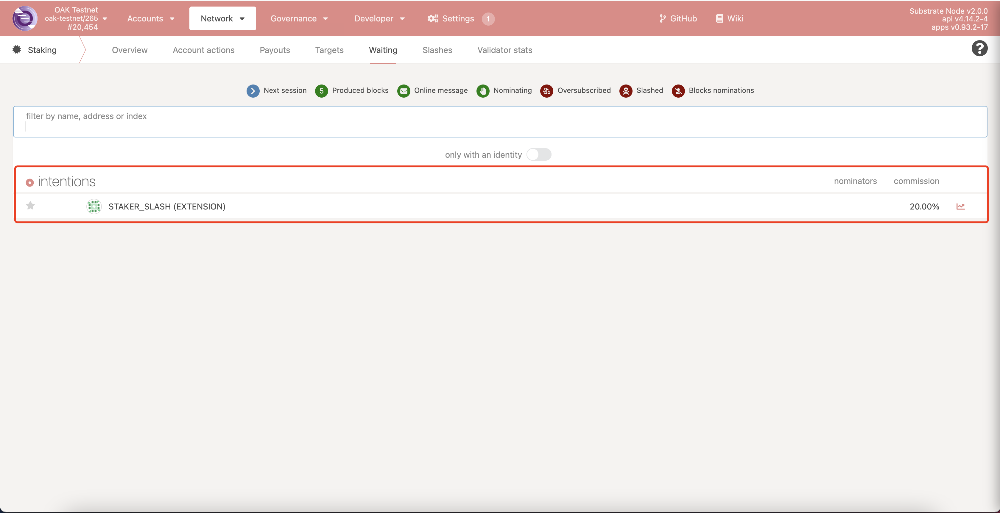
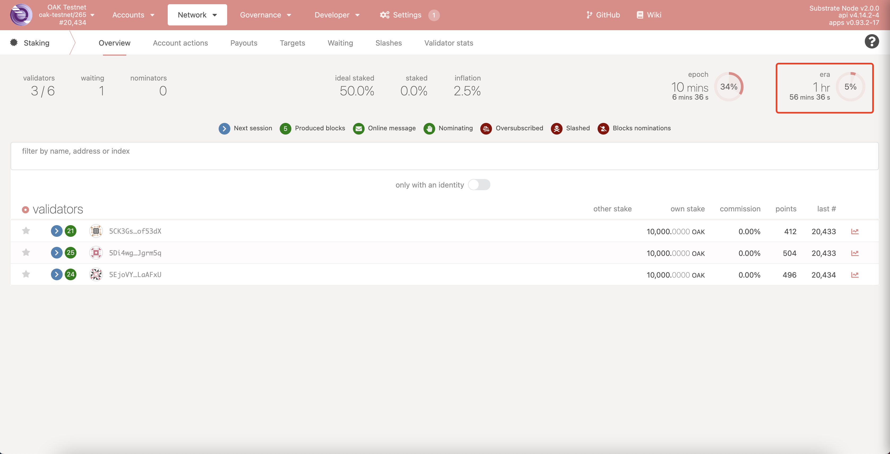

## Run a validator node

Then run the following command to run a validator node

### Run a validator node
```bash
docker run -d -p 9993:9933 --name <container_name> oaknetwork/oak_testnet:latest --name <node_name> --validator --rpc-cors all --rpc-methods=unsafe
```

### Get the rotateKeys of the node

```
curl -H "Content-Type: application/json" -d '{"id":1, "jsonrpc":"2.0", "method": "author_rotateKeys", "params":[]}' http://localhost:9933
```

```
{"jsonrpc":"2.0","result":"0xd63605b333d1a706bddfa0c79e930fbcb3db786d59181289b19d698e4c8f7b5ca2b5e55a59fa94bf0a147a4aa697c9ff90ed075923bf17d7c80ca1daccb2c31e10cb1cc74a53f5ce5fb048ac12e2d0c8d74eed658ba85dc6788e67077b5e871ad8dbf6d47a1233dd40d3b17ce6c130c274a3f83779105416c8e3e1c929f62618","id":1}
```

The output will have a hex-encoded "result" field. The result is the concatenation of the four public keys. Save this result for a later step.


## Add validator

### Open this link and click 'Validator'
https://polkadot.js.org/apps/?rpc=wss%3A%2F%2Frpc.testnet.oak.tech#/staking/actions

### setup validator

#### setup validator 1/2


There are some fileds.

##### Stash account, controller account
Think of the stash as your cold wallet and the controller as your hot wallet. Funding operations are controlled by the stash, any other non-funding actions by the controller itself.


##### value bonded
The amount placed at-stake should not be your full available available amount to allow for transaction fees.
Once bonded, it will need to be unlocked/withdrawn and will be locked for at least the bonding duration.

##### payment destination
Rewards (once paid) can be deposited to either the stash or controller, with different effects.

After filling the form, click 'next' to the form of 'setup validator 2/2'

#### setup validator 2/2



There are some fileds.

##### Keys from rotateKeys
Fill the string generated form [Run a validator node](https://github.com/OAK-Foundation/OAK-blockchain/blob/add_validator_setup_doc/docs/validator-setup.md#run-a-validator-node)

##### reward commission percentage
The commission is deducted from all rewards before the remainder is split with nominators.
For example, 20.

##### allows new nominations
The validator can block any new nominations. By default it is set to allow all nominations.

After commit, you can see your accont in the stashes list.


And you can the account in the waitting list.


After a era, your account is in the validators list.




